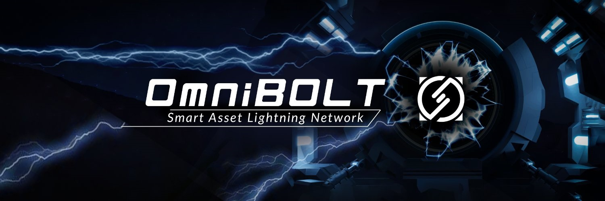
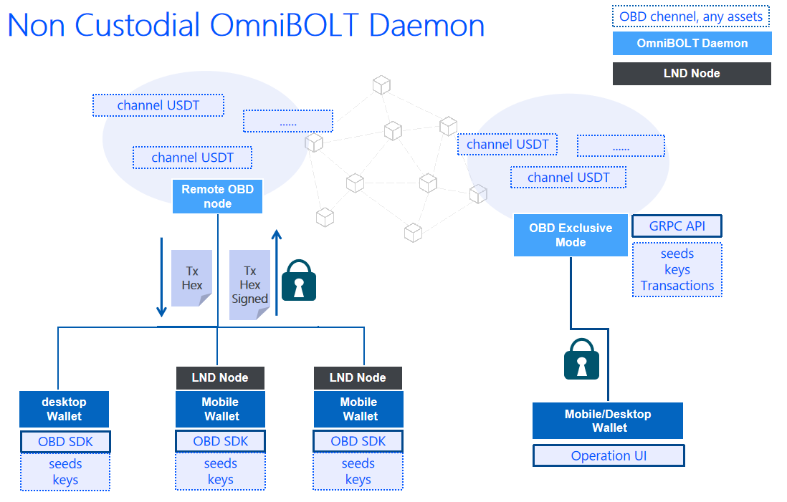

# OmniBOLT Daemon | Smart Asset Lightning Network
[](https://github.com/omnilaboratory/obd/blob/master/LICENSE) [](https://github.com/omnilaboratory/obd/blob/master/README.md) [](https://golang.org/dl/) [](https://github.com/omnilaboratory/OmniBOLT-spec) 
[](https://api.omnilab.online) 

<p align="center">
  
</p>


OBD implements the [OmniBOLT](https://github.com/omnilaboratory/OmniBOLT-spec) specification, and it is an open source, off-chain decentralized platform, build upon BTC/OmniLayer network, implements basic multi hop HTLC payment, multi-currency atomic swap, and more off-chain contracts on the network of [smart assets lightning channels](https://github.com/omnilaboratory/OmniBOLT-spec/blob/master/OmniBOLT-02-peer-protocol.md#omni-address).  

<p align="center">
  
</p>
    

<!-- The latest document/tutorial has been moved to [OmniBOLT - Developers](https://omnilaboratory.github.io/obd/#/OBD-README).  -->

To know how obd works, jump to the [OmniBOLT - Architecture](https://omnilaboratory.github.io/obd/#/Architecture).  

The latest features and ETA is here: [OmniBOLT - Features and Roadmap](https://omnilaboratory.github.io/obd/#/features).  

## Quick Start on Regtest:

Users can get quickly started with graphic or command line tools:  

#### Polar
The graphic terminal is provided by Polar, and is customized for obd: [Polar - GUI Terminal Customized](https://github.com/omnilaboratory/polar/releases). 

Polar helps Lightning Network application developers quickly build networks locally on their computers. Here is a short video demo: [https://twitter.com/omni_bolt/status/1549709303921410048?s=20&t=-M9Y4L0Bw_VialiSVPgqmA](https://twitter.com/omni_bolt/status/1549709303921410048?s=20&t=-M9Y4L0Bw_VialiSVPgqmA)  

#### Docker

Docker helps people to quickly interact with obd and omnicore via command line tools. OBD uses `docker-compose` to package `obd`, `omnicored`, and `btcd` together to make deploying these daemons easily. Please check the `docker-compose.yml` config file for all the configurations under:

```
https://github.com/omnilaboratory/lnd/tree/obd/docker/obtest
```

We compiled and deployed images for your testing: 
* obd docker: ccr.ccs.tencentyun.com/omnicore/ob-lnd:0.1.0

Now we can:  

#### Mint tokens  
Using omnicore to issue tokens with fixed amount or manageable supply:  

For example, use [`omni_sendissuancefixed`](https://github.com/OmniLayer/omnicore/blob/master/src/omnicore/doc/rpc-api.md#omni_sendissuancefixed) to issue `1000000` `Quantum Miner` tokens on the Bitcoin mainchain: 
```
$ omnicore-cli "omni_sendissuancefixed" \
    "3Ck2kEGLJtZw9ENj2tameMCtS3HB7uRar3" 2 1 0 "Companies" "Bitcoin Mining" \
    "Quantum Miner" "" "" "1000000"
```

Please visit [https://github.com/OmniLayer/omnicore/blob/master/src/omnicore/doc/rpc-api.md](https://github.com/OmniLayer/omnicore/blob/master/src/omnicore/doc/rpc-api.md) to learn how to use omnicore to manage tokens on-chain.  
 

#### Build obd network, and Lightning pay tokens

[test-shell-template.md](https://github.com/omnilaboratory/lnd/blob/obd/docker/obtest/test-shell-template.md) instructs how to start with command line tool to interact with obd, including: 
* [build a network with three nodes(Alice, Bob, Carol)](https://github.com/omnilaboratory/lnd/blob/obd/docker/obtest/test-shell-template.md#startup) 
* [generate address](https://github.com/omnilaboratory/lnd/blob/obd/docker/obtest/test-shell-template.md#newaddress)
* [fund each node by assets](https://github.com/omnilaboratory/lnd/blob/obd/docker/obtest/test-shell-template.md#faucet)  
* [open channels](https://github.com/omnilaboratory/lnd/blob/obd/docker/obtest/test-shell-template.md#openchannel) 
* [create invoices](https://github.com/omnilaboratory/lnd/blob/obd/docker/obtest/test-shell-template.md#addinvoice) 
* [pay invoices](https://github.com/omnilaboratory/lnd/blob/obd/docker/obtest/test-shell-template.md#sendpayment)  

The testing asset id is `--asset_id = 2147483651`.  

To issue assets on the Bitcoin/Omnilayer mainnet, you should deploy an omnicore full node and execute the cli to mint. For non-developers, we recommend you to visit the official [https://www.omniwallet.org/](https://www.omniwallet.org/) (https://github.com/OmniLayer/omniwallet) for easier and quicker managing your assets.  

## Backend and Faucet(Regtest, Testnet)

The [omnicore proxy](https://github.com/omnilaboratory/omnicore-proxy) offers the backend public anonymous omni/bitcoin services for obd nodes.  
It is specified in the parameter `omnicoreproxy.rpchost` when an OBD node starts. For example, as in the `docker/lnd/start-a.sh, docker/obtest/docker-compose.yml`, the `regnet.oblnd.top:18332` is where the proxy deployed:  
```
command: >-
      lnd-debug --noseedbackup --trickledelay=5000 --alias=alice
      --externalip=alice --tlsextradomain=alice --tlsextradomain=alice
      --listen=0.0.0.0:9735 --rpclisten=0.0.0.0:10009 --restlisten=0.0.0.0:8080
      --bitcoin.active --bitcoin.regtest --bitcoin.node=omnicoreproxy
      --omnicoreproxy.rpchost=regnet.oblnd.top:18332 
      --omnicoreproxy.zmqpubrawblock=tcp://regnet.oblnd.top:28332
      --omnicoreproxy.zmqpubrawtx=tcp://regnet.oblnd.top:28333
```

The proxy decouples the lightning node and the full Bitcoin/Omnilayer node, to lower the barriers of OBD deployment, especially for mobile nodes. 

The complete white-listed services are: [https://github.com/omnilaboratory/omnicore-proxy/blob/master/whitelist_proxy/whitelist_proxy.go](https://github.com/omnilaboratory/omnicore-proxy/blob/master/whitelist_proxy/whitelist_proxy.go).  

OBD supports three networks: regtest, testnet and mainnet; Each network supports three backends: bitcoind, omnicore proxy, and neutrino. For a neutrino backend, an omnicore proxy must be specified.  

The network is specified by param: `--bitcoin.xxxxxx`:  　
```shell
#regtest 
--bitcoin.regtest
#testnet 
--bitcoin.testnet
#mainnet 
--bitcoin.mainnet
```

The backend is specified by: `--bitcoin.node=[bitcoind|omnicoreproxy|neutrino|]`:  
(Currently, we only support these 3 modes, each has different connection type and certification method.)  
* bitcoind
```shell
  --bitcoind.rpchost="$BTC_HOST_ADDRESS_PORT"
  --bitcoind.rpcuser="$RPCUSER"
  --bitcoind.rpcpass="$RPCPASS" 
  --bitcoind.zmqpubrawblock=tcp://"$BTC_HOST_ADDRESS":28332 
  --bitcoind.zmqpubrawtx=tcp://"$BTC_HOST_ADDRESS":28333
```
* omnicoreproxy
```shell
    --omnicoreproxy.rpchost="$OMNI_HOST_ADDRESS_PORT" 
    --omnicoreproxy.zmqpubrawblock=tcp://"$OMNI_HOST_ADDRESS_PORT":28332 
    --omnicoreproxy.zmqpubrawtx=tcp://"$OMNI_HOST_ADDRESS_PORT":28333
```

* neutrino
```shell
    --neutrino.connect="$BTC_HOST_ADDRESS"
    --omnicoreproxy.rpchost="$OMNI_HOST_ADDRESS_PORT"
    --neutrino.feeurl=https://nodes.lightning.computer/fees/v1/btc-fee-estimates.json #only mainnet
```  

#### Depolyed Backends
On each network, not all 3 backends are deployed. We currently maintain the following backends for the community:   

* regtest: ~3 blocks per 2 minutes.
```
  * omnicoreproxy
    * Asia：  
      `$omni_host_adress_port`=43.138.107.248   
      `$omni_host_adress_port`=43.138.107.248:18332   
      faucet：[http://43.138.107.248:9090/swaggerTool/?surl=http://43.138.107.248:8090/openapiv2/foo.swagger.json](http://43.138.107.248:9090/swaggerTool/?surl=http://43.138.107.248:8090/openapiv2/foo.swagger.json)  

  * neutrino
    * Asia：  
      `$omni_host_adress_port`=43.138.107.248   
      `$omni_host_adress_port`=43.138.107.248:18332   
      faucet：[http://43.138.107.248:9090/swaggerTool/?surl=http://43.138.107.248:8090/openapiv2/foo.swagger.json](http://43.138.107.248:9090/swaggerTool/?surl=http://43.138.107.248:8090/openapiv2/foo.swagger.json)  
    * neutrino.db downloading list: https://cache.oblnd.top/neutrino-regtest/  
      When downloading neutrino.db, add date to url to get correct file. For example: https://cache.oblnd.top/neutrino-regtest/neutrino.db?date=2022-12-22 
    * Put the downloaded database file under `${LNDIR}/data/chain/bitcoin/regtest/`  
```

* testnet  ~1 blocks per 2 to 18 minutes.  
```
  * neutrino
    * Asia：
      `$BTC_HOST_ADDRESS`=192.144.199.67  
      `$OMNI_HOST_ADDRESS_PORT`=192.144.199.67:18332  
      token faucet: [http://43.138.107.248:9090/swaggerTool/?surl=http://192.144.199.67:8090/openapiv2/foo.swagger.json](http://43.138.107.248:9090/swaggerTool/?surl=http://192.144.199.67:8090/openapiv2/foo.swagger.json)  
      token-property id: 2147485160   
      token-owner: mvd6r2KRoaMVr7Y9mDe8pDxe5a5iZLJHN9  
      
    * Other countries and regions:  
      `$BTC_HOST_ADDRESS`=testnet.oblnd.top  
      `$OMNI_HOST_ADDRESS_PORT`=192.144.199.67:18332  
      token faucet: [http://43.138.107.248:9090/swaggerTool/?surl=http://192.144.199.67:8090/openapiv2/foo.swagger.json](http://43.138.107.248:9090/swaggerTool/?surl=http://192.144.199.67:8090/openapiv2/foo.swagger.json)  
      token-property id: 2147485160      
      token-owner: mvd6r2KRoaMVr7Y9mDe8pDxe5a5iZLJHN9  

    * btc-testnet faucet: https://testnet-faucet.com/btc-testnet/  
    * neutrino.db downloading list: https://cache.oblnd.top/neutrino-testnet/    
      When downloading neutrino.db, add date to url to get correct file. For example: https://cache.oblnd.top/neutrino-testnet/neutrino.db?date=2022-12-22
    * We generate database file at 8:00 UTC+8 every day.   
    * Put the downloaded database file under `${LNDIR}/data/chain/bitcoin/testnet/`  
```        
    
      
* mainnet
　to be done. 


## Liquidity nodes
Liquidity nodes offer token/BTC inbound/outbound liquidity to users' nodes, especially for OBWallet mobile nodes.  
* regtest: 0386790984cda19a179486bf45f7a1d7dc58964605b928e3d36cd7806ce3d31cdb@otest:9735  
* testnet: 025767c2a772bb48f04117625c2da759d55d3e287c101602452c5228c975111594@192.144.199.67:9735  
* mainnet: TO BE ADDED  


## Community

Discord: [http://discord.gg/2QYqzSMZuy](http://discord.gg/2QYqzSMZuy)  
Slack: [https://join.slack.com/t/omnibolt/shared_invite/zt-ad732myf-1G7lXpHPkFH_yRcilwT4Ig](https://join.slack.com/t/omnibolt/shared_invite/zt-ad732myf-1G7lXpHPkFH_yRcilwT4Ig)

## Video Tutorials
Video tutorials can be found here:   
  
* [OmniBOLT Technology guide part I](https://youtu.be/G-T_uwqzDAI)  

## Mainnet warning
OBD is still in an early stage, and `sendToMany` in omnicore is still under development. We do not recommend running it on mainnet with real money just yet, which may lead to loss of funds unless you want to take a reckless adventure.  

## Security
If you discover a vulnerability, weakness, or threat that can potentially compromise the security of obd, we ask you to keep it confidential and submit your concern directly to [the team](mailto:neo.carmack@gmail.com?subject=%5BGitHub%5D%20OmniBOLT%20Security).

 
