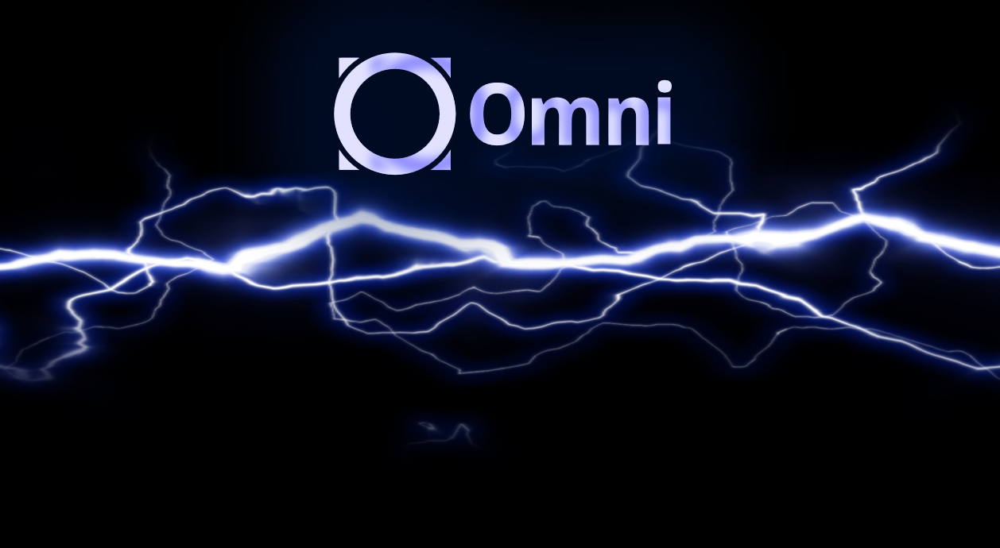

# OmniBOLT Daemon | Smart Asset Lightning Network
    
 

  

OBD implements the [OmniBOLT](https://github.com/omnilaboratory/OmniBOLT-spec) specification, and it is an open source, off-chain decentralized platform, build upon BTC/OmniLayer network, implements basic multi hop HTLC payment, multi-currency atomic swap, and more off-chain contracts on the network of [smart assets lightning channels](https://github.com/omnilaboratory/OmniBOLT-spec/blob/master/OmniBOLT-02-peer-protocol.md#omni-address).  

  

In addition, OBD is designed special for inbound liquidity providers. A daemon allows thousands of remote light clients connections, including connections from [LND wallets](https://omnilaboratory.github.io/obd/#/Architecture?id=lnd-integrated). 

Clone, compile the source code and run the binary executable file, you will have a featured OmniBOLT deamon(OBD) to start the journey of lightning network.     

The latest document/tutorial has been moved to [OmniBOLT - Developers](https://omnilaboratory.github.io/obd/#/OBD-README).  

To know how OBD works, jump to the [OmniBOLT - Architecture](https://omnilaboratory.github.io/obd/#/OBD-README).  

The latest features and ETA is here: [OmniBOLT - Features and Roadmap](https://omnilaboratory.github.io/obd/#/features).  

Graphic terminal that assists you get started quikly is here: [OmniBOLT - GUI Terminal](https://omnilaboratory.github.io/obd/#/GUI-tool). 

Video tutorials can be found here:   

* [Step 1 -- create and fund channel](https://youtu.be/PbbNk2JCopA)
* [Step 2 -- create invoice](https://youtu.be/Z9UmHFclGdc)
* [Step 3 -- pay invoice](https://youtu.be/NEexFe7R9kc)

 
