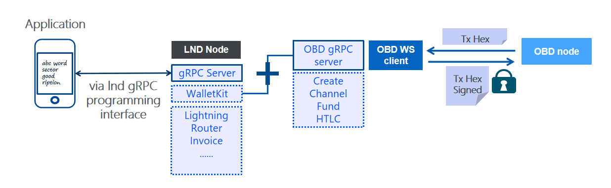

## Non Custodial OmniBOLT Daemon

(latest updated Nov 06, 2020)

  

OBD(OmniBOLT daemon) offers two mode: non-custodial mode and exclusive mode. 

## Non-custodial mode
non-custodial mode means clients' seeds and keys are not generated by or stored in obd, but in their own local storage, which is managed by client SDK. Every time a client(wallet) needs to sign a transaction, it receives the transaction's hex from the remote obd it connects, uses corresponding private keys to sign, and send the signed hex back. The keys will never be exposed to the network. OBD, together with omnicore, validates the signature, but has no knowledge of clients' private information. So that even if the obd server has been hacked, users' transaction data are still secure: hackers can not make any transaction to steal without users' seed or key.

Users don't need to trust any obd node, even those nodes they deploy by themselves.

## Exclusive mode
Exclusive mode works in the same way as lnd. Every user should run his own obd node. His obd node manages and stores all his keys. For application integrators, obd exposes GRPC API to interact and the tech stack is the same to lnd, which is familiar to integrators.  

OBD is designed for both (inbound ) liquidity providers and individual users:

## liquidity provider

The business model for a liquidity providers is straight forword. They connect to as many clients as possible, and earn channel fees by providing funded channels as relays of payments. Liquidity providers shall make sure the service quality of their nodes, especially the quality of being constantly online in order to earn more money during their service. With this motivation, we can expect that these liquidity providers bring sufficient funded channels hence better connectivity to the network.

More importantly, when you(the wallet client) go offline, these kind of nodes keep monitoring you counterparties activities, and punishing cheating activities if there are any, which are basic functions of a lignting node.

We recommend users to connect to liquidity providers' nodes and regularly backup channel data to local device.

## individual user

If you have complete knowledge of how block chain and lightning network works, you will try to run your own obd node. The new release of obd is easy to install, you should be able to run your own node within 5 minutes. Please go to [installation](https://omnilaboratory.github.io/obd/#/OBD-README?id=installation) to get started.

## LND integration

OBD releases two versions of SDK, one is [js SDK](https://omnilaboratory.github.io/obd/#/js-sdk), the other is integrated with current LND SDK.

  

Since LND wallet is a custodial wallet, it stores your seeds and keys in its local storage, so that you shall run your own lnd full node to initialte a wallet. While obd allows remote connections. 
 
For the purpose of lesser dependency to integrators, it is reasonable to assume developers are willing to work with current LND programming interface, so we just add extra functions to LND gRPC set. Our current solution is:  

<!-- 
1. Release an installation package including both lnd and obd, and the two nodes share one omnicore/btccore;   

2. For existing LND nodes, user shall install obd as a plugin, OR: ;  

3. Simply connect to a remote obd node using newly added obd api, which is: ;  

4. Asset related functions that are added to the current LND grpc api set, so that application developers will still work with the original LND interface. If he wants to use asset related functions, he just call the addtional client functions we add.  

5. The original LND APIs are and will be BTC transaction only. Our newly added functions will automatically switch the context to obd node that connected;  

6. New functions have clear context when program an application, and are better than embedding metadata to existing LND api;  -->

1. OBD SDK consists of a websocket client that operates OBD node, and a gRPC server that provide services to applications;  

2. OBD gRPC server calls LND wallet kit to generate seed for a new user, and all keys of this user are derived from this seed;  

3. OBD websocket client connects remote/local OBD node;  

4. Merge OBD gRPC interfaces into LND gRPC api set. Newly added gRPC APIs have distinguishable but indicative names. For example: openAssetChannel, comparing to LND's openChannel which is the BTC only method;  

5. You (application developer) will still work with LND gPRC server, hence no extraneous dependency is brought into your tech stack. When you call asset related functions, OBD gRPC server will automatically switch the context to obd node that is connected;  

It has much more clear context in the way offerring new functions, instead of embedding metadata into existing LND api. BTC channel network is logically seperated from asset channel network. This solution is not finalized yet. If you disagree and believe there are other better ways to let the two network work together, then I’d love to hear your thinking as well.

The project address is: https://github.com/omnilaboratory/lnd

## OBD Project organization 

* `bean`:  
	* `chainhash`:   
	* `enum`:    

* `config`:  

* `dao`:   

* `lightclient`:  
	 
* `rpc`:  

* `service`:  

* `tool`:  

* `tracker`:  
	* `bean`:   
	* `dao`:    
	* `service`:   

 
