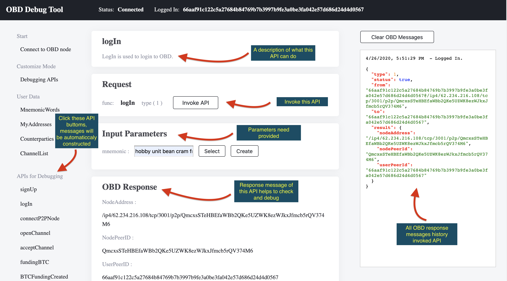
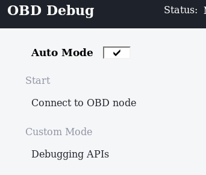

# OBD GUI Tool
[](https://github.com/omnilaboratory/obd/blob/master/LICENSE) [](https://github.com/omnilaboratory/obd/blob/master/README.md) [](https://github.com/omnilaboratory/OmniBOLT-spec) 
[](https://api.omnilab.online) 


OmniBOLT Daemon Debugging Tool. This is a graphic user interface for developers. Every API on the left navigation tree has been defined in [api.omnilab.online](https://api.omnilab.online). This tool is in fact a lightning wallet.  

If you come to this tool in developing modules for OmniBOLT, you must have successfully installed and run OBD on your local or remote machine. If you do not familiar with the whole process yet, we suggest you [install](https://github.com/omnilaboratory/obd#table-of-contents) OBD first and try to run it for a quick experience.  

In this tutorial, you can connect either your own OBD node, or the [nodes in the testnet](https://github.com/omnilaboratory/DebuggingTool#Nodes-in-testnet) we configured for our community. 

<p align="center">
  
</p>

* [Videos](#video-tutorials)
* [Installation](#installation-clone-this-project-and-run-it-by-chrome)
* [Nodes in the testnet](#Nodes-in-testnet)
* [Operations](#operations) 
* [Auto pilot mode](#auto-pilot-mode)
* [JS-SDK](#js-sdk)
* [how to use APIs](#how-to-use-apis)
 	
## Video Tutorials

Video tutorials can be found here:   

* [Step 1 -- create and fund channel](https://youtu.be/PbbNk2JCopA)  
* [Step 2 -- create invoice](https://youtu.be/Z9UmHFclGdc)  
* [Step 3 -- pay invoice](https://youtu.be/NEexFe7R9kc)  


## Installation: clone this project and run it by Chrome

```
git clone https://github.com/omnilaboratory/DebuggingTool
```

Chrome must run with the argument `disable-web-security` to disable the web security strategy. For example, if you are in Windows terminal:  

```
chrome.exe --args --disable-web-security --user-data-dir=/any_temp_directory_for_chrome_data
```

Then open index.html under the DebuggingTool directory.

> Remark: We use some local JSON files to store the content of each interface, such as interface name, description, parameter list, etc.
In the js code, we use jQuery’s `$.getJSON(jsonFile, function(result) {}` method to parse these json files. Chrome by default prohibits the access of this form of cross-domain resource.  

There are currently three solutions:  
1) Start Chrome by disabling the web security policy: --disable-web-security.  
2) Run a web server, and put the debugging tool in the corresponding directory, so that Chrome can visit the URL normally.  
3) Use Safari or other browsers to run the debugging tool.  

If you run an older version before, we strongly suggest you clear your browser storage before open index.html. Before the first stable version is released, we can not guarantee that every update is backward compatible: we have to tune the storage structure according to obd updates.   


<p align="center">
  
</p>

There are currently three solutions:  
1) Start Chrome by disabling the web security policy: --disable-web-security.  
2) Run a web server, and put the debugging tool in the corresponding directory, so that Chrome can visit the URL normally.  
3) Use Safari or other browsers to run the debugging tool.  

If you run an older version before, we strongly suggest you clear your browser storage before opening the index.html. Before the first stable version is released, we can not guarantee that every update is backward compatible: we have to tune the storage structure according to obd updates.   


## Nodes in testnet

* [Nodes in testnet](https://omnilaboratory.github.io/obd/#/nodes-in-testnet)


## Operations 


* [create account and channel](https://omnilaboratory.github.io/obd/#/gui-account-channel)  
* [fund the channel](https://omnilaboratory.github.io/obd/#/gui-fund-channel)  
* [pay invoice](https://omnilaboratory.github.io/obd/#/gui-pay-invoice)  


## Auto pilot mode

During forwarding HTLCs, a channel shall construct tens of temporary unbroadcast transactions, so lots of private keys needed to be manually managed. Enable this mode, the obd will be your surrogate, will help you fill in all the private keys, and automatically answer the remote requests.

<p align="center">
  
</p>

## JS SDK

The JS SDK is located under [/SDK](https://github.com/omnilaboratory/DebuggingTool/tree/master/sdk). It implements a complete set of APIs for HD wallets and client applications. It manages pub/priv keys generation and helps developers automatically fill in the OBD arguments which are hard to be manually finished.

## How to use APIs

JS/TypeScript examples can be found under [js/common.js](https://github.com/omnilaboratory/DebuggingTool/blob/master/js/common.js).

Or you will seek help via [online API documentation](https://api.omnilab.online). 


