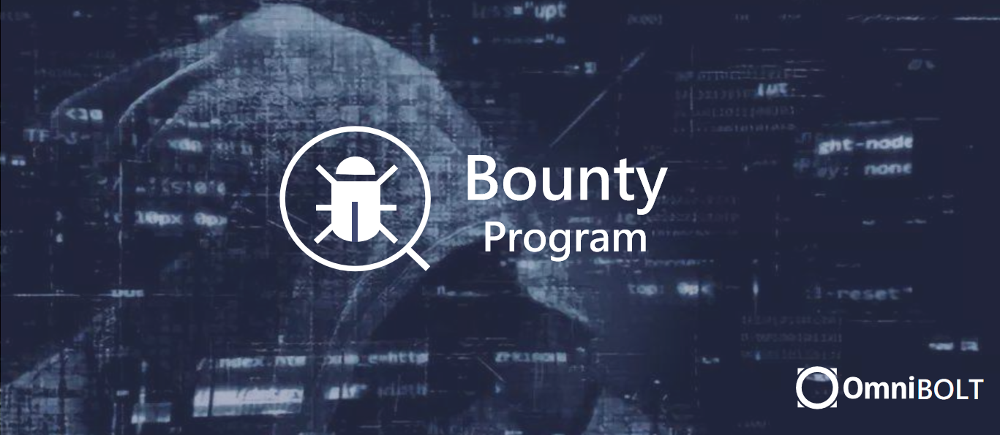

# Bug Bounty Program

* `Contact`: Neo Carmack(neocarmack@omnilab.online), Ben Fei(benfei@omnilab.online)

  

## Introduction

(latest updated Oct 3, 2020)

The OmniBOLT network leverages lightning technology to provide quick and safety guarantees for anyone who wish to build scalable, decentralized payment apps. Working with skilled security researchers and hackers across the globe plays a crucial role in improving security of our network. Therefore we launched a bug bounty program to find vulnerabilities and pay rewards. 

This bug bounty program encourages participants to identify and submit bugs/flaws/vulnerabilities that could negatively impact OmniBOLT network users. Successful submissions have a chance of being eligible for a bounty reward. The scope of our program and the bounty levels are provided in more detail below.

## Scope

With the launch of the bug bounty program we put the following components in scope:  

`OBD Core`: [the obd code base](https://github.com/omnilaboratory/obd).  
	* channle operation
	* payment
	* query
	* network
	* application contracts

`JS SDK`: [JS SDK](https://omnilaboratory.github.io/obd/#/js-sdk) is for light client that interacts with local/remote obd node.  
`LND plugin`: [LND plugin](https://github.com/omnilaboratory/lnd) runs obd as a plugin for lnd, and adds interfaces to lnd grpc package to operate obd channel.  
 
Do code review for logical and security mistake in our testnet: obd is a new lightning network that was written from scratch by the community. The OmniBOLT team has been adding a lot enterprise friendly features at the core level so that it could be easily used by any third party who runs obd as its business: serving millions of light wallet clients, providing liquidity to the network, or other value added services to its clients. 

Participants can use GUI tool to access all services without the need to spend any time on installation, setup and configuration of obd node. To get started please visit [this tutorial](https://omnilaboratory.github.io/obd/#/GUI-tool).   

 
## What to look for

## How to submit bug reports

## Bounty Rewards

* The bounty amount will be determined in USDT and will only be paid out in online OmniWallet. We will need your omni address.   
* Successful submissions are rewarded based on the severity of the issue.  
* We generally use CVSSv3 scoring system to understand the risk of an issue. This might not always make sense to determine the bounty reward though especially for the smart contracts.  
* This software is under heavy development, the issue you open may already in our todo list, therefor it is a mutual understanding that you may not be the first one who identify the bug/flaw/vulnerability. But we will pay you reward accordingly for your double confirmation.  

The following table gives an overview of the reward structure:   
				
|  Component Category  |        Low       |      Medium       |        High       |      Critical      | 
|     OBD Core         |  up to 250 USD	  |  up to 1,500 USD  | up to 75,000 USD  |  up to 15,000 USD  | 
|      JS SDK  	       |  up to 250 USD	  |  up to 1,500 USD  | up to 75,000 USD  |  up to 15,000 USD  | 
|    LND plugin        |  up to 250 USD	  |  up to 1,500 USD  | up to 75,000 USD  |  up to 15,000 USD  |
  

## Rules 
