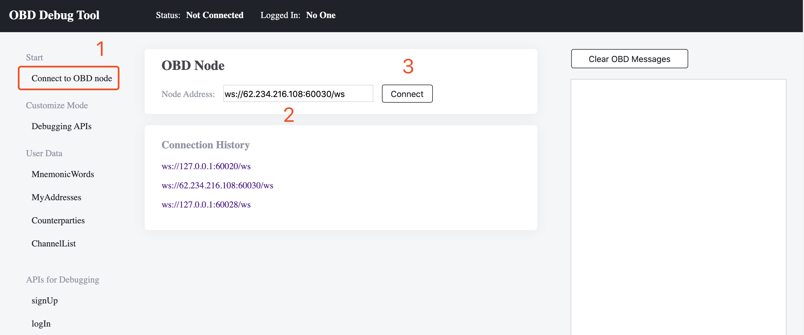
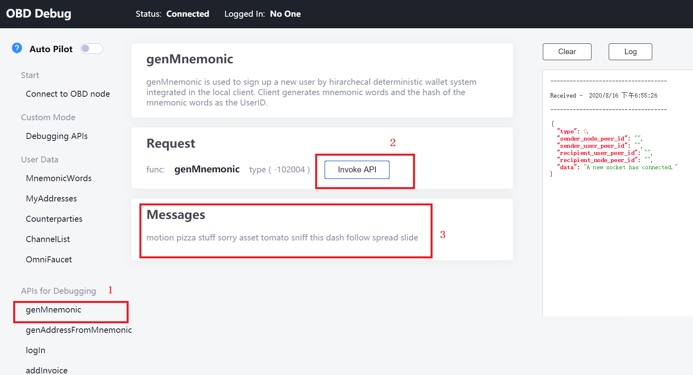
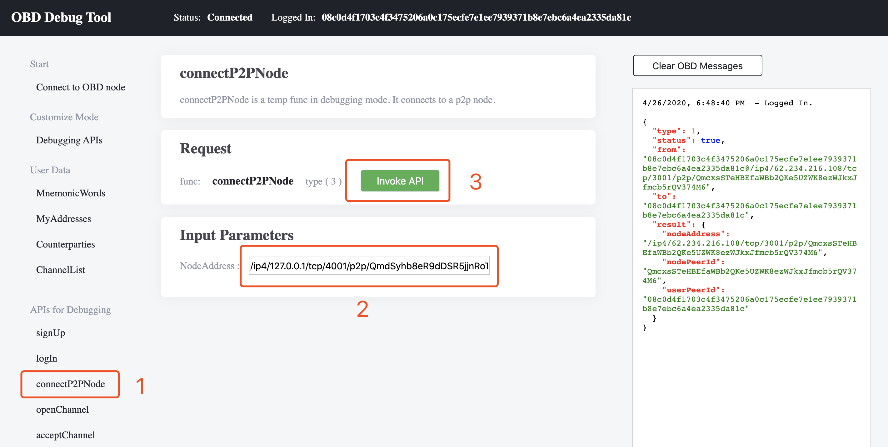
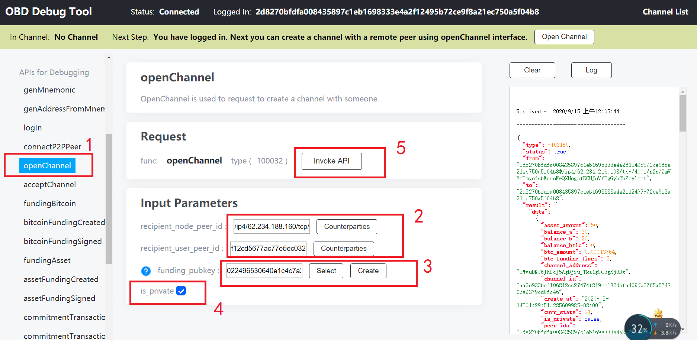
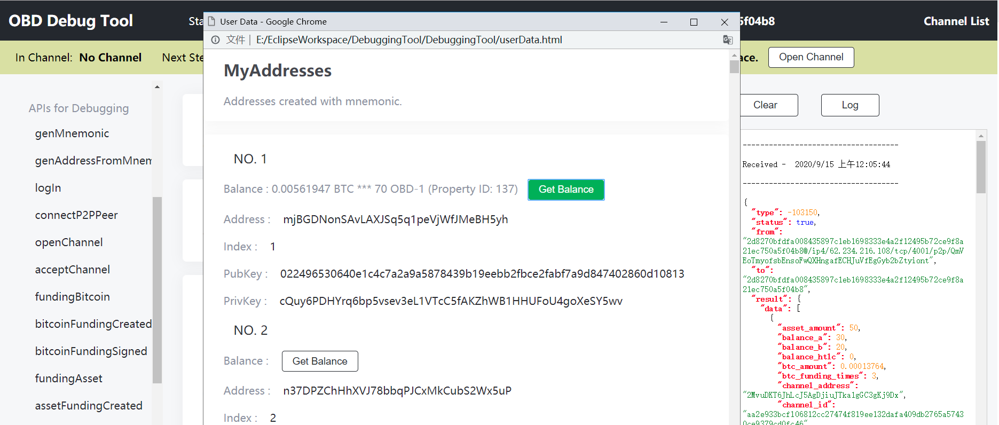

## Step 1: connect to an OBD node

<p align="center">
  
</p>

1. click "Connect to OBD node";  
2. on the right panel, appears the input box. connect you local obd node or one of the [nodes in the testnet](#Nodes-in-testnet), for example: `ws://62.234.216.108:60020/wstest`. Just replace the default `127.0.0.1:60020` by `62.234.216.108:60020`  
3. click "connect". wait for several seconds, the status bar on top of the window will show the status "connected".

If you want to build and deploy your own OBD, you shall go through the installation intruction at [obd repository](https://github.com/omnilaboratory/obd#installation).

## Step 2: signup a new user

<p align="center">
  
</p>

1. click "signUp";  
2. click "invoke API";  
3. OBD responses the new set of mnemonic words for the currently connected new user. The mnemonic words is the identity to carry out all the following operations in obd network; Record this mnemonic words in somewhere safe. For example, write it down on a paper.  


## Step 3: login using mnemonic words

<p align="center">
  
</p>

1. click "login";  
2. in the input box of "Input Parameters", past the mnemonic words generated in step 2, and  
3. click "invoke API";  
4. OBD responses 3 arguments, telling user where and who he is:  

```
nodeAddress : /ip4/62.234.216.108/tcp/3001/p2p/QmP1mQMzDRV2bKWdhwvPWFubSAz1gqJY44RjdYm3G5DFeF
```
`nodeAddress` is the node location of the OBD server you connected. In this tutorial, it is the node "ws://62.234.216.108:60030/ws" you connected in step 1.  

```
nodePeerId : QmP1mQMzDRV2bKWdhwvPWFubSAz1gqJY44RjdYm3G5DFeF
``` 
`nodePeerId` is part of the complete `nodeAddress`. Because on one server, there can be thousans of OBD running on it, every OBD has a unique `nodePeerId` to be identified.  

```
userPeerId : 30dfbc0e1b42c4cb50410b7a08186ce405a92fff235480608425bf4b0207e5ad
```
This is the user id, which is used together with `nodeAddress` to tell someone else that "i'm here, please connect me by connectP2PPeer".  

We assume this first window belongs to user Alice.

## Step 4: connect another user

Open another browser window, open index.html, and signup another user to get his `nodeAddress` and `userPeerId`. In this tutorial, this second window belongs to user Bob.

Switch back to Alice's window, we shall input Bob's `nodeAddress` and `userPeerId` to build connection with Bob.  

<p align="center">
  
</p>

switch back to Alice's window;  
1. click "connectP2PPeer";  
2. input the `nodeAddress` into the "NodeAddress" input box;  
3. click "invoke API";  

## Step 5: open channel

Click openChannel, input the arguments required by this function and click "invoke API", wait Bob's response. 

<p align="center">
  
</p>

switch back to Alice's window;  
1. click "openChannel";  
2. input the `recipient_node_peer_id` which is the node id that Bob is using, like: `/ip4/62.234.188.160/tcp/4001/p2p/QmTxpMkwXyFNbwwRv3XGFgxZkdCM5UfxNHVAFZDukqsM5S`  
   input the `recipient_user_peer_id` which is bob's user id, like: `f12cd5677ac77e5ec03280eeb175464960f0d075413da74c0cfd88bb65fc1b3c`

3. click "select" to select a "funding_pubkey": select an address's pubkey that can be used to fund the channel that you are now creating with Bob:  

<p align="center">
  
</p>

in the pop-up window, click "get balance" to see the balance of each address. Copy one of these pubkey and close the window. Past the pubkey you just copied to the input box `funding_pubkey`. 

Another option is `create`, which creates a new omni address. You shall use thirdparty bitcoin/omnilayer faucet to fund this address. In this GUI playground, omnifaucet is under the left side bar `User Data --> OmniFaucet`.  

4. enable "is_private": if you want your channel and all your transactions to be hidden, you must enbale "is_private".

5. click "invoke API";  


In the other window you just opened in step 4 for Bob, you will see an incoming message asking for opening a channel with Bob. Click "acceptChannel", leave the default values that the js SDK filled for you, response Alice to accept the "openChannel" request.  

## Step 6: create an invoice

<p align="center">
  
</p>


switch back to Alice's window;  
1. click "createInvoice";  
2. input the `property_id`, `amount`, `h` `expiry_time` and short memo, where `h` is the locker (`hash(r)`) that payer uses it to lock a payment, only you can unlock it by your secrete `r`;  
3. click "invoke API", you will see the beth32 encoded invoice string and QR code are created;  

Share ths invoice string or QR code to anyone (not only Bob) who is going to pay you. But before you can actually receive money, you at least have a funded channel, which you dont have yet. So please go to the next section to study how to fund a channel. 


## Step 7: channel operations

You are able to keep going with other operations. Go to the [next section](https://omnilaboratory.github.io/obd/#/gui-fund-channel) to practise how to fund the channel and pay to others. Or if you want to dive deeper, to see what really happens during an invoice payment process, we suggest you manually operate according the steps in the [inside the payment process](https://omnilaboratory.github.io/obd/#/gui-pay-invoice?id=inside-the-process-of-invoice-payment). 

Online API documents lists all the channel operations step by step, and testing demo data as well. Please visit OBD [online API documentation](https://api.omnilab.online) to learn how to fill in arguments to work with OBD.  
