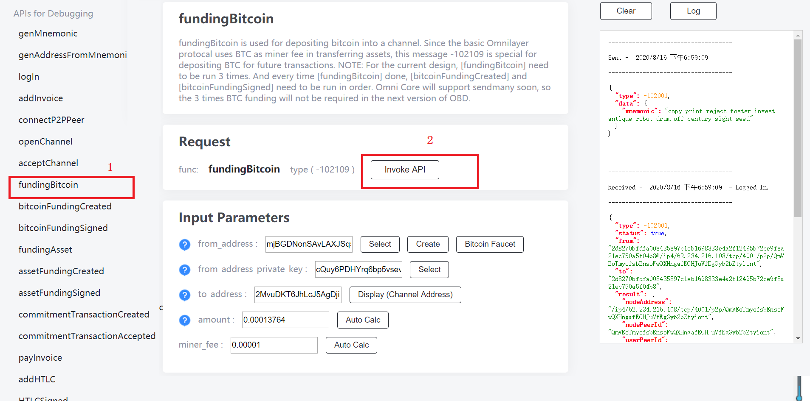
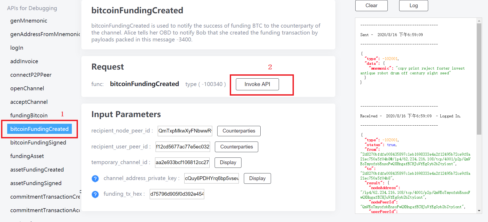
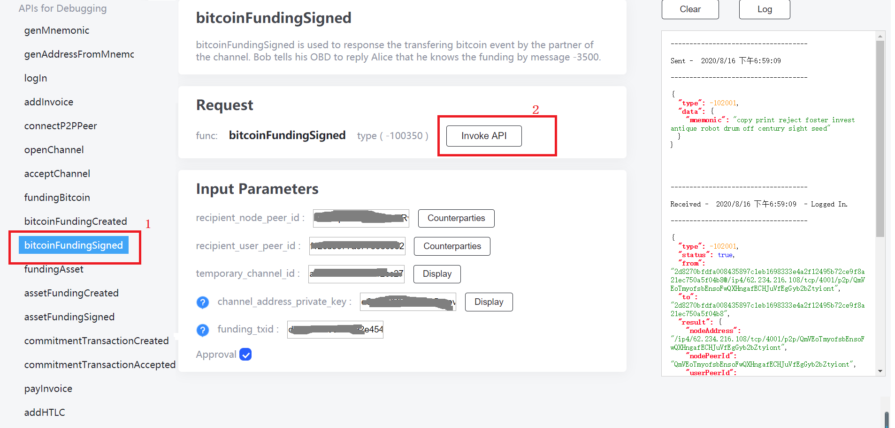
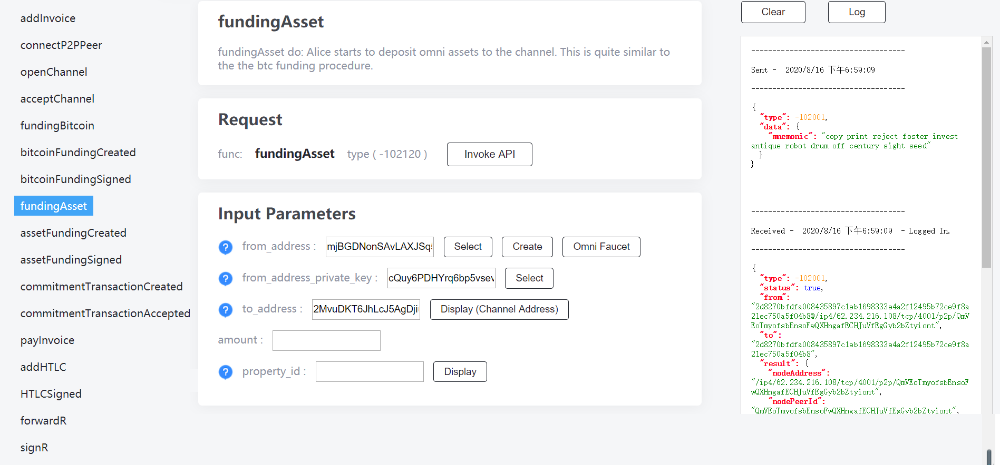
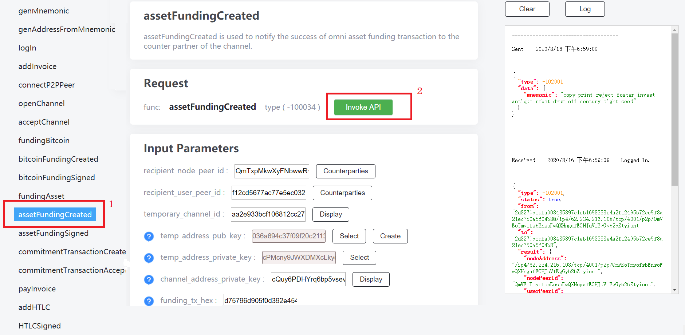
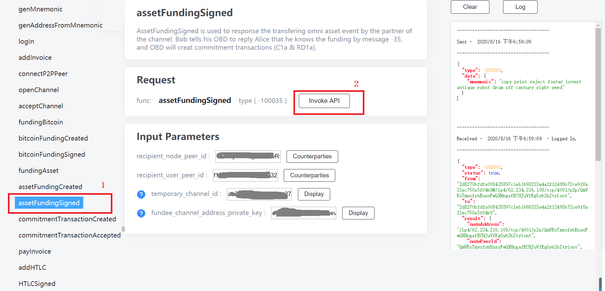

Currently being released Omnicore does not support sendmany, so that we have to fund the channel three times in order to get multiple outputs that are used in constructing internal lightning transactions. The bitcoin funding process MUST follows strictly:  

step 1 funds Bitcoin ==> Step 2: tells Bob funding Bitcoin transaction created ==> Step 3: Bob signs the Bitcoin funding message

then Alice start step 1 over again after she gets Bos's response. 

After three rounds of bitcoin funding, Alice shall begin to fund the channel assets(step 4). Just one round of asset funding is suffice. 

## Step 1: funds Bitcoin

  

On Alice's screen.

## Step 2: tells Bob funding Bitcoin transaction created

  

On Alice's screen.

## Step 3: Bob signs the Bitcoin funding message

  

On Bob's screen.

## Step 4: funds asset

  

On Alice's screen.

## Step 5: tells Bob funding assets transaction created

  

On Alice's screen.

## Step 6: Bob signs the assets funding message

  

On Bob's screen.
