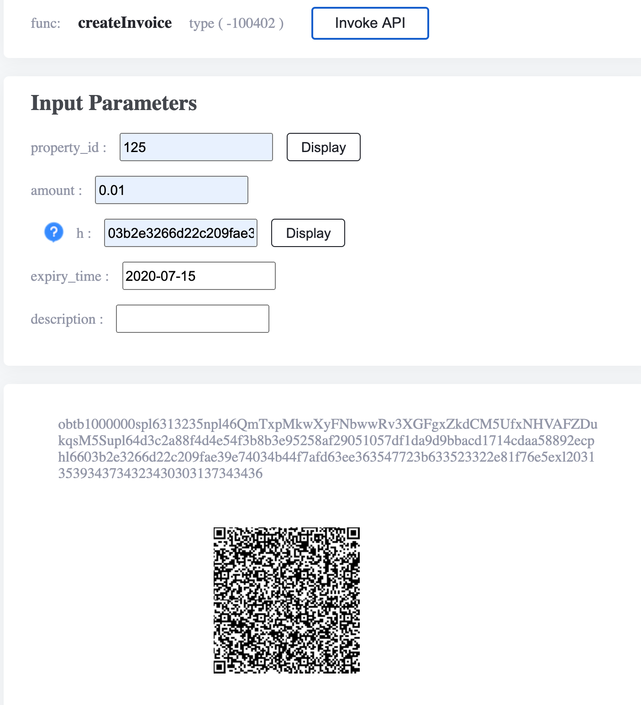
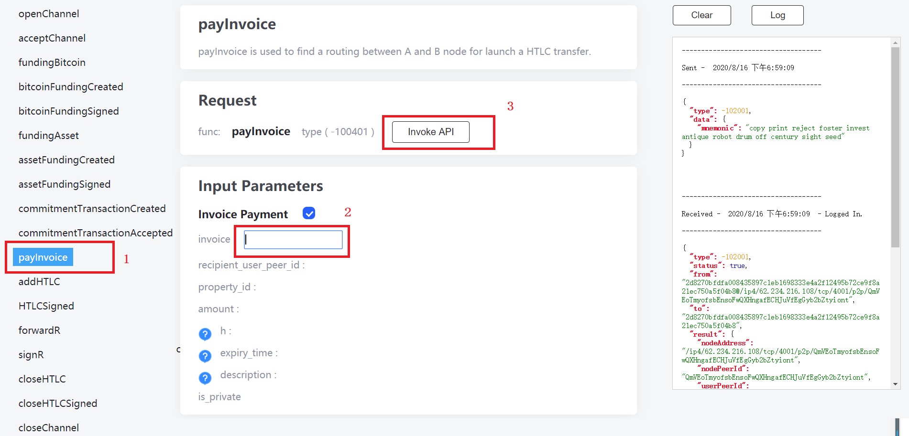
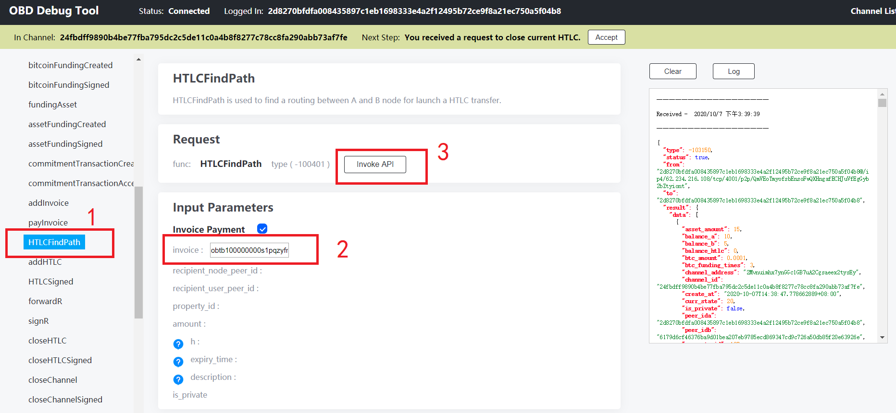
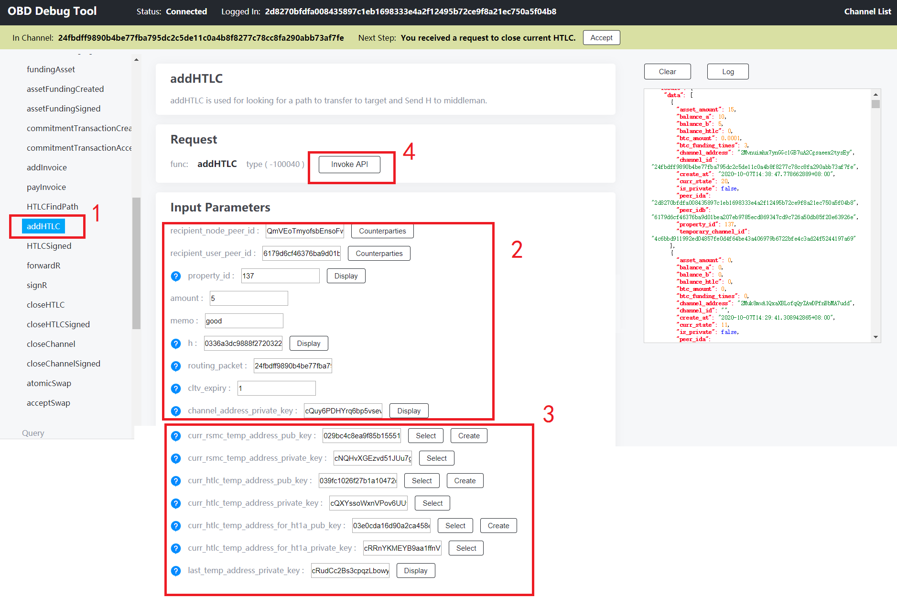
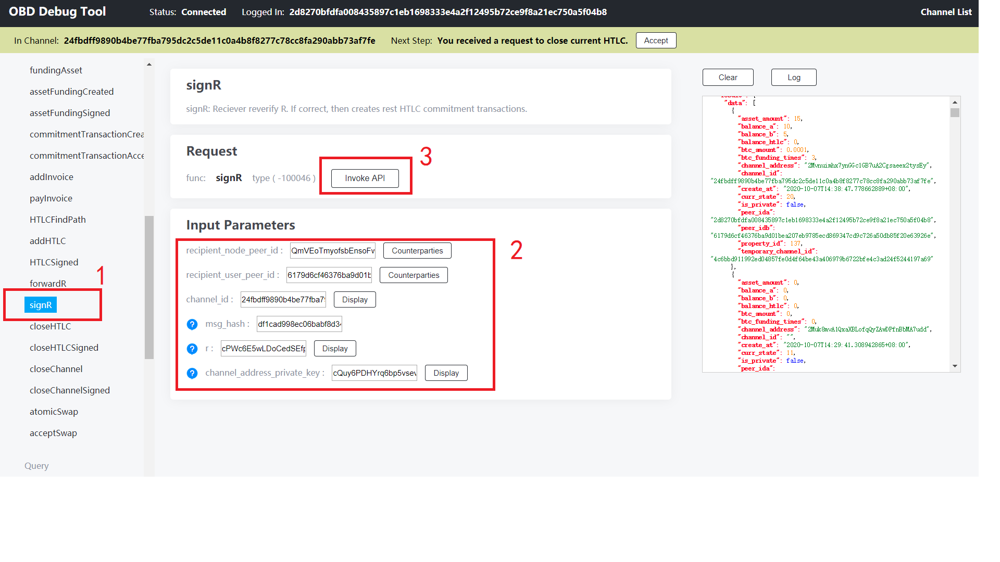
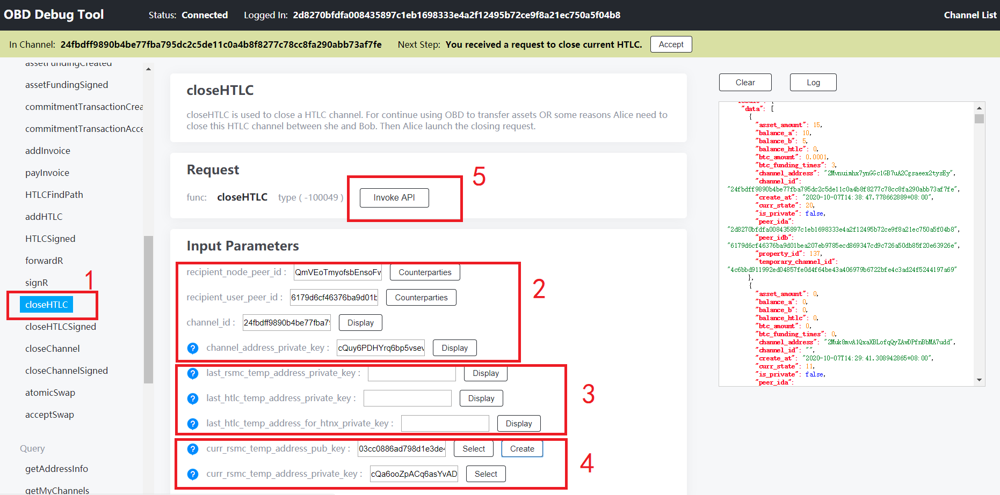

## pay invoice

After a channel has been funded, Alice or Bob are able to pay to each other or any one else in the network. Here we let Bob to create an invoice:

<p align="center">
  
</p>

1. switch to Bob's window;  
2. click "createInvoice";  
3. input the `property_id`, `amount`, `h` `expiry_time` and short memo, where `h` is the locker (`hash(r)`) that Bob uses it to lock a payment, only Bob can unlock it by the secrete `r`;  
4. click "invoke API", Bob will see the beth32 encoded invoice string and QR code are created;  

You can use `genAddressFromMnemonic` to create an address, use the public key as `h` and the private key as `r`.  

Share ths invoice string or QR code to Alice:   
 

<p align="center">
  
</p>

On Alice's screen:  
1. click "payInvoice";  
2. past the invoice string in the box;  
3. click "invoke API", then Bob's obd and Alice's obd will communicate with each other to finish the payment process automatically. 

The invoice system simplifies the complex process of multi hop HTLC payment. Users don't need to manually response every incomming message, but it you want to go deeper to see what happens during a payment life cycle, we suggest you to keep reading:  
 
 
## inside the process of invoice payment


```
    +-------+                                    +-------+
    |       |---(1)---   HTLCFindPath   -------->|       |
    |       |---(2)---     addHTLC      -------->|       |
    |       |                                    |       |
    | Alice |<--------   HTLCSigned     ---(3)---|  Bob  |
    |       |<--------    forwardR      ---(4)---|       |
    |       |                                    |       |
    |       |---(5)---      signR       -------->|       |
    |       |                                    |       |
    |       |   either Alice or Bob can close    |       |
    |       |                                    |       |
    |       |<--------    closeHTLC     ---(6)---|       |
    |       |                                    |       |
    |       |---(7)---  closeHTLCSigned -------->|       |
    |       |                                    |       |
    |       |                 or                 |       |
    |       |                                    |       |
    |       |---(6)---     closeHTLC    -------->|       |
    |       |                                    |       |
    |       |<--------  closeHTLCSigned ---(7)---|       |
    +-------+                                    +-------+

    - where node Alice is the 'payer' and node Bob is the 'payee' >.  

```

### find a payment path

<p align="center">
  
</p>

On Alice's screen:  
1. click "HTLCFindPath";  
2. past the invoice string in the box;  
3. click "invoke API", then Alice's obd will find out a payment path. The reponse message on the right panel shows the routing packge and other information which will be used in the next step "addHTLC".  
  

### add HTLC

<p align="center">
  
</p>

On Alice's screen:  
1. click "addHTLC";  
2. these parameters shall be automatically filled. If not, parameters are in the response of previous "HTLCFindPath";  
3. these parameters shall be automatically filled. If it is the first time payment in this channel, Alice can press "create" to create these "curr_xxxx" params. 
4. click "invoke API", then Alice's obd will create this HTLC and send it to Bob.  
  
 
### sign HTLC

On Bob's side, automatically sign this HTLC.  

### forword R to unlock HTLC

Bob uses "forwardR" to send Alice the secrete R.  

### sign R to accept unlocking HTLC

<p align="center">
  
</p>

On Alice's screen:  
1. click "SignR";  
2. these parameters shall be automatically filled. If not, parameters are in the message of "forwardR" that Bob sent to Alice in the previous step;  
3. click "invoke API". If there are multiple hops, every middle node (including Alice) uses R to create remaining transactions required by this HTLC. (need to be clarified).
  


### close HTLC 

Either Alice or Bob can close HTLC to finish this payment. 

<p align="center">
  
</p>

On Alice's (payer) screen:  
1. click "closeHTLC";  
2. manually select from the pop up window;  
3. these parameters shall be automatically filled. If not, clich "Display" to select. (To be explained which message before includs these params);  
4. these parameters shall be automatically filled. If not, click "Create" to fill in;  
5. click "invoke API".   


### sign to close HTLC
On the payee's screen:  

Click "closeHTLCSigned", sign to agree closing the HTLC, then this HTLC will be closed and the balance of both sides will be updated accordingly. The resource occupied by this HTLC will be released, and the channel will be available for other operations. 
