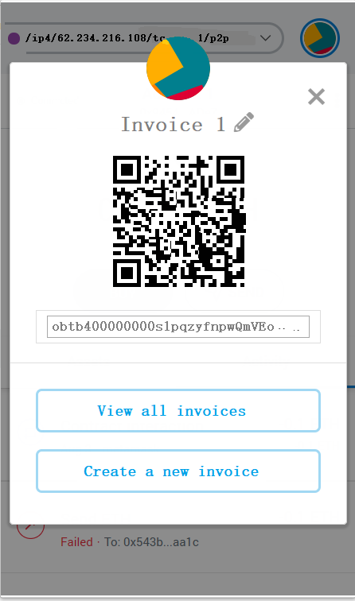
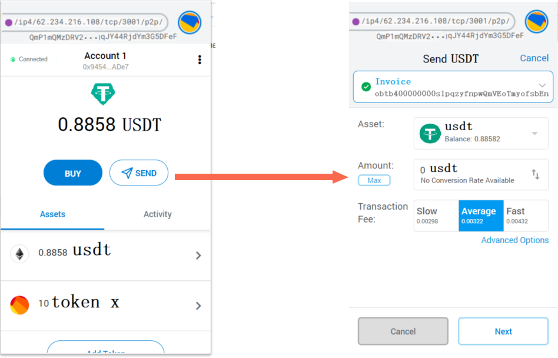

# Step by step to write your first lightning wallet


First, you should put all of [JS SDK](https://github.com/omnilaboratory/DebuggingTool/tree/master/sdk) files 
under your project's path.

And, following steps below will help you to build your first lightning wallet, and the code can be embeded in any mobile or desktop applications that support JS:

* [Step 1: connect to an OBD node](#step-1-connect-to-an-obd-node)
* [Step 2: signup a new user](#step-2-signup-a-new-user)
* [Step 3: login using mnemonic words](#step-3-login-using-mnemonic-words)
* [Step 4: connect another user](#step-4-connect-another-user)
* [Step 5: open channel](#step-5-open-channel)
* [Step 6: create an invoice](#step-6-create-an-invoice)
* [Step 7: pay an invoice](#step-7-pay-an-invoice)
  

## Step 1: connect to an OBD node

<p align="center">
  
</p>

Invoke **connectToServer** function from [wallet.js](https://github.com/omnilaboratory/DebuggingTool/blob/master/sdk/wallet.js) of SDK.

First parameter is `nodeAddress`. It's a URL of the OBD node like `ws://62.234.216.108:60020/wstest`.

Second parameter is `callback`. It's a callback function could be used to process the return data.

Third parameter is `globalCallback`. It's a callback function could be used to process the global messages.

#### Example Code:

```js
// URL of an OBD node
let nodeAddress = 'ws://62.234.216.108:60020/wstest';

// SDK API
connectToServer(nodeAddress, function(response) {
    console.info('Print the callback = ' + response);

    // Your code to process the callback data.
    // Example: Display the success or fail message on app screen.

}, function(globalResponse) {
    // Your code to process the global callback data.

});
```

Full example in GUI-tool you could be see [sdkConnect2OBD](https://github.com/omnilaboratory/DebuggingTool/blob/master/js/common.js) function.


## Step 2: signup a new user

<p align="center">
  
</p>

Invoke **genMnemonic** function from [wallet.js](https://github.com/omnilaboratory/DebuggingTool/blob/master/sdk/wallet.js) of SDK.

`genMnemonic` function is used to sign up a new user by hirarchecal deterministic wallet system integrated in the local client. Client generates mnemonic words and the hash of the mnemonic words as the UserID.

#### Example Code:

```js
// SDK API
let mnemonicWords = genMnemonic();

// Your code to process the data.
// Example: Display the mnemonic words on app screen.
```

Full example in GUI-tool you could be see [sdkGenMnemonic](https://github.com/omnilaboratory/DebuggingTool/blob/master/js/common.js) function.


## Step 3: login using mnemonic words

<p align="center">
  
</p>

Invoke **logIn** function from [wallet.js](https://github.com/omnilaboratory/DebuggingTool/blob/master/sdk/wallet.js) of SDK.

First parameter is `mnemonic`. It's mnemonic words generated from **genMnemonic** function.

Second parameter is `callback`. It's a callback function could be used to process the return data.

#### Example Code:

```js
let mnemonic = 'mnemonic words';

// SDK API
logIn(mnemonic, function(e) {
    // Print the callback data
    console.info('SDK: -102001 logIn = ' + JSON.stringify(e));

    // SDK API: For auto pilot mode, register event for listening.
    // @param netType --> true: testnet  false: mainnet
    registerEvent(true);

    // Your code to process the callback data.
    // Example: Save mnemonic words used by a user to log in
    // SDK API
    saveMnemonic(e.userPeerId, mnemonic);
});
```

Full example in GUI-tool you could be see [sdkLogIn](https://github.com/omnilaboratory/DebuggingTool/blob/master/js/common.js) function.


## Step 4: connect another user

<p align="center">
  
</p>

Connect a remote user, then you will be able to creat your first channel in the network. If you already have a channel, you can jump to the next step to pay or create invoices to collect money.

Invoke **connectPeer** function from [wallet.js](https://github.com/omnilaboratory/DebuggingTool/blob/master/sdk/wallet.js) of SDK.

First parameter is `P2PPeer object`. It contains node address you will connect to. The node address returned by **logIn** function. It looks like this:

```
/ip4/62.234.216.108/tcp/3001/p2p/QmP1mQMzDRV2bKWdhwvPWFubSAz1gqJY44RjdYm3G5DFeF
```

Second parameter is `callback`. It's a callback function could be used to process the return data.

#### Example Code:

```js
let info                 = new P2PPeer();
info.remote_node_address = 'node address';

// SDK API
connectPeer(info, function(e) {
    // Print the callback data
    console.info('SDK: -102003 connectPeer = ' + JSON.stringify(e));

    // Your code to process the callback data.
});
```

Full example in GUI-tool you could be see [sdkConnectP2PPeer](https://github.com/omnilaboratory/DebuggingTool/blob/master/js/common.js) function.


## Step 5: open channel

Invoke **openChannel** function from [basic.js](https://github.com/omnilaboratory/DebuggingTool/blob/master/sdk/basic.js) of SDK.

First parameter is `myUserID`. It's the user id of the client currently logged in.

Second and third parameter are `nodeID` and `remoteUserID`. Both returned by **logIn** function. Explanation is [here](https://omnilaboratory.github.io/obd/#/GUI-tool?id=step-3-login-using-mnemonic-words)

Final parameter is `OpenChannelInfo object`. It contains `public key` of the address that you will use to create channel address. And `is_private` means the channel is public or private.

#### Example Code:

```js
let nodeID       = 'nodePeerId';
let remoteUserID = 'userPeerId';

let info            = new OpenChannelInfo();
info.funding_pubkey = 'public key of an address';
info.is_private     = true or false;

// SDK API
openChannel(myUserID, nodeID, remoteUserID, info);
```

Let's check out the `openChannel` function.

```js
function openChannel(myUserID, nodeID, remoteUserID, info) {
    obdApi.openChannel(nodeID, remoteUserID, info, function(e) {
        // Print the callback data
        console.info('SDK: -100032 openChannel = ' + JSON.stringify(e));

        // To simplify development, we save some data to local storage at client.
        // All of this is SDK APIs.
        let channel_id = e.temporary_channel_id;
        saveCounterparty(myUserID,  channel_id, nodeID, userID);

        // Save channel's status, you can use it to display custom tips.
        saveChannelStatus(myUserID, channel_id, true, kStatusOpenChannel);

        let privkey = getPrivKeyFromPubKey(myUserID, info.funding_pubkey);
        saveFundingPrivKey(myUserID, channel_id, privkey);
    });
}
```

In `openChannel` function we call the OBD's function `openChannel`. The final parameter is `callback`. To simplify development, we save some data of callback and others to local storage at client.

Full example in GUI-tool you could be see [sdkOpenChannel](https://github.com/omnilaboratory/DebuggingTool/blob/master/js/common.js) function.


## Step 6: create an invoice 

<p align="center">
  
</p>

Invoke **addInvoice** function from [htlc.js](https://github.com/omnilaboratory/DebuggingTool/blob/master/sdk/htlc.js) of SDK.

First parameter is `InvoiceInfo object`. Explanation is [here](https://omnilaboratory.github.io/obd/#/GUI-tool?id=step-6-create-an-invoice)

Second parameter is `callback`. It's a callback function could be used to process the return data.

#### Example Code:

```js
let info         = new InvoiceInfo();
info.property_id = 'property id of an asset';
info.amount      = 'amount';
info.h           = 'hash of r';
info.expiry_time = 'expiry time';
info.description = 'a memo';

// SDK API
addInvoice(info, function(e) {
    // Print the callback data
    console.info('SDK: -100402 addInvoice = ' + JSON.stringify(e));

    // Your code to process the callback data.
    // Example: create a QR code 
    // makeQRCode(e);
});
```

Full example in GUI-tool you could be see [sdkAddInvoice](https://github.com/omnilaboratory/DebuggingTool/blob/master/js/common.js) function.


## Step 7: pay an invoice 

<p align="center">
  
</p>

Pay invoice is the automated execution of a series of JS SDK APIs in order to achieve the purpose of transferring assets to the countparty in one step.

The detailed steps are:

1) Alice enters the invoice provided by Bob and launchs it.

2) Alice invokes `HTLCFindPath` API to find a way.

3) Successfully find a way, Alice automatically invokes `addHTLC` API.

4) Bob received `addHTLC` notification and reply `HTLCSigned` API. When the auto pilot is turned on, `HTLCSigned` invoked automatically, otherwise do it manually.

5) While `HTLCSigned` invoked done. Then Bob automatically invokes `forwardR` API.

6) Alice received `forwardR` notification and automatically invokes `signR` API.

7) Next, Alice automatically invokes `closeHTLC` API.

8) Bob received `closeHTLC` notification and automatically invokes `closeHTLCSigned` API.

#### Example Code:

```js
let myUserID   = 'user id of currently logged in';
let channel_id = 'channel_id';

// Step 1: HTLCFindPath
let info     = new HTLCFindPathInfo();
info.invoice = 'invoice';

let e        = await HTLCFindPath(info);
let path     = e.routing_packet;

if (channel_id != path) {
    // Using new channel to process this htlc.
    channel_id = path;
}

saveHTLCPathData(e);

// Step 2: addHTLC
payInvoiceStep2(e, myUserID, channel_id);

// Step 3: HTLCSigned from Bob
... ...
```

Full example in GUI-tool you could be see [payInvoice](https://github.com/omnilaboratory/DebuggingTool/blob/master/js/common.js) function.

## Remark

before you create or pay an invoice, you must have your channel correctly funded by the token you want to collect or pay. To fund your channel, we suggest you firstly experience via the GUI playground:  

[Fund channel by bitcoins and tokens](https://omnilaboratory.github.io/obd/#/gui-fund-channel).  

If you want to dive deeper into the internal protocol that how invoice payment works, we suggest you read the [doc here](https://omnilaboratory.github.io/obd/#/gui-pay-invoice) 


