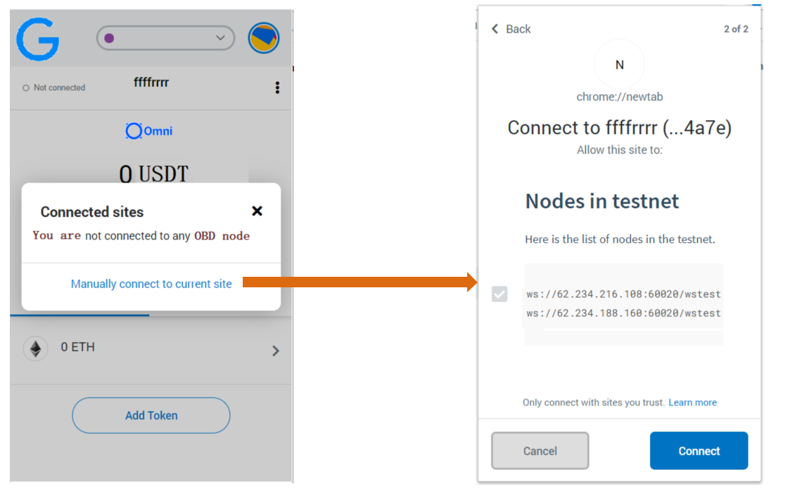
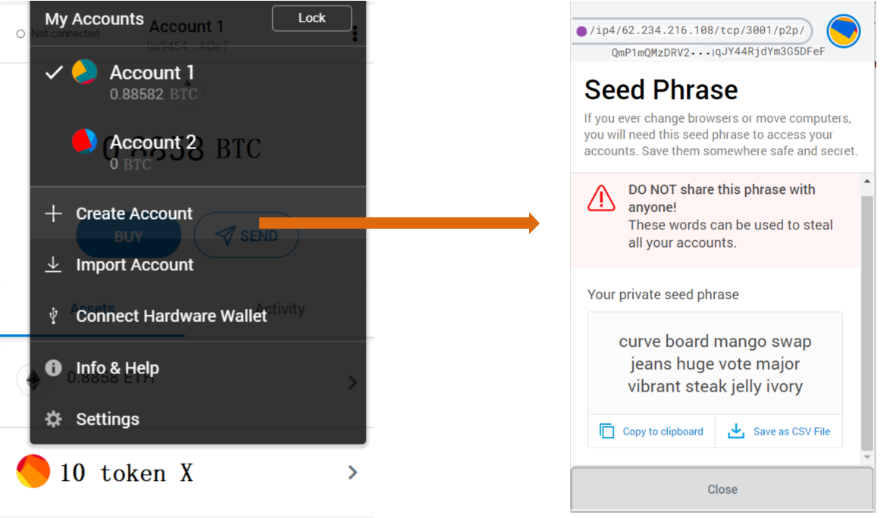
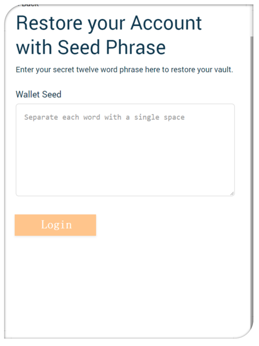
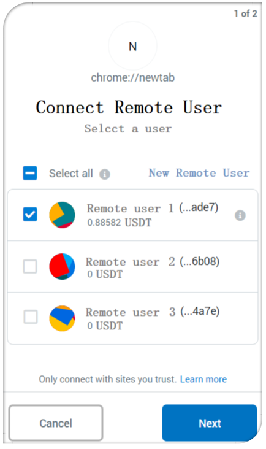

# 5 minutes to build a basic wallet app


First, you should put all of [JS SDK](https://github.com/omnilaboratory/DebuggingTool/tree/master/sdk) files 
to your path of project.

And, following these steps below in your code:

* [Step 1: connect to an OBD node](#step-1-connect-to-an-obd-node)
* [Step 2: signup a new user](#step-2-signup-a-new-user)
* [Step 3: login using mnemonic words](#step-3-login-using-mnemonic-words)
* [Step 4: connect another user](#step-4-connect-another-remote-user)
* [Step 5: open channel](#step-5-create-channel)
* [Step 6: create an invoice](#step-6-create-an-invoice)
* [Step 7: channel operations](#step-7-channel-operations)

## Step 1: connect to an OBD node

<p align="center">
  
</p>

Invoke **connectToServer** function from [wallet.js](https://github.com/omnilaboratory/DebuggingTool/blob/master/sdk/wallet.js) of SDK.

First parameter is `nodeAddress`. It's a URL of the OBD node like `ws://62.234.216.108:60020/wstest`.

Second parameter is `callback`. It's a callback function could be used to process the return data.

Third parameter is `globalCallback`. It's a callback function could be used to process the global messages.

#### Example Code:

```js
// URL of an OBD node
let nodeAddress = 'ws://62.234.216.108:60020/wstest';

// SDK API
connectToServer(nodeAddress, function(response) {
    console.info('Print the callback = ' + response);

    // Your code to process the callback data.
    // Example: Display the success or fail message on app screen.

}, function(globalResponse) {
    // Your code to process the global callback data.

});
```

Full example in GUI-tool you could be see [sdkConnect2OBD](https://github.com/omnilaboratory/DebuggingTool/blob/master/js/common.js) function.


## Step 2: signup a new user

<p align="center">
  
</p>

Invoke **genMnemonic** function from [wallet.js](https://github.com/omnilaboratory/DebuggingTool/blob/master/sdk/wallet.js) of SDK.

`genMnemonic` function is used to sign up a new user by hirarchecal deterministic wallet system integrated in the local client. Client generates mnemonic words and the hash of the mnemonic words as the UserID.

#### Example Code:

```js
// SDK API
let mnemonicWords = genMnemonic();

// Your code to process the data.
// Example: Display the mnemonic words on app screen.
```

Full example code is at: [sdkGenMnemonic](https://github.com/omnilaboratory/DebuggingTool/blob/master/js/common.js) function.


## Step 3: Login

<p align="center">
  
</p>


## Step 4: connect another remote user
<p align="center">
  
</p>

Connect a remote user, then you will be able to creat your first channel in the network. If you already have a channel, you can jump to the next step to pay or create invoices to collect money.

## Step 5: create channel

to be done

## Step 6: create an invoice 

to be done


